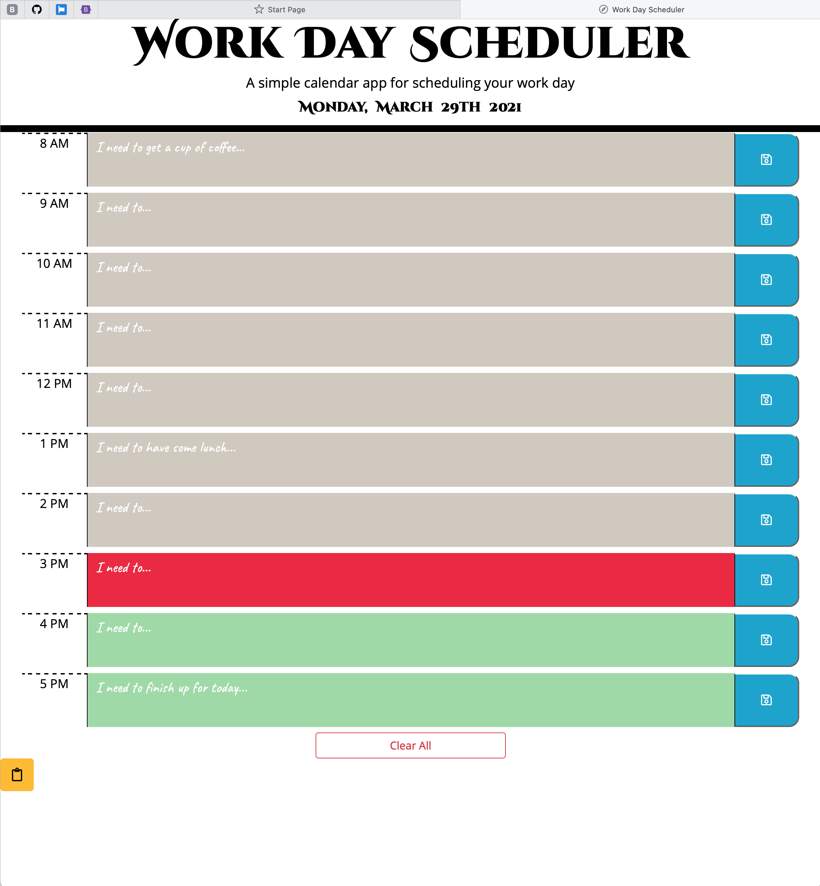

# Work-Day-Scheduler
* Coding Bootcamp - Assignment - Week 5 - Work Day Scheduler
 

## Table of Contents
* [General Info](#general-info)
* [Live URL](#live-url)
* [Walkthrough](#walkthrough)
* [Webpage Preview](#webpage-preview)
* [Contributing](#contributing)
* [Notes](#notes)

 

## General Info

 

### Live URL
https://joyofcodinglife.github.io/Week5-A-Work-Day-Scheduler/

 

## Walkthrough

 

## Webpage Preview
The following images show the web application's appearance.

 

## Contributing
Pull requests are welcome. For major changes, please open an issue first to discuss what you would like to change, so I learn and understand it better.

Please make sure to update tests as appropriate.
 

## Notes
Quote that recently inspired me:

    ""

---
© 2021 L Korolyova