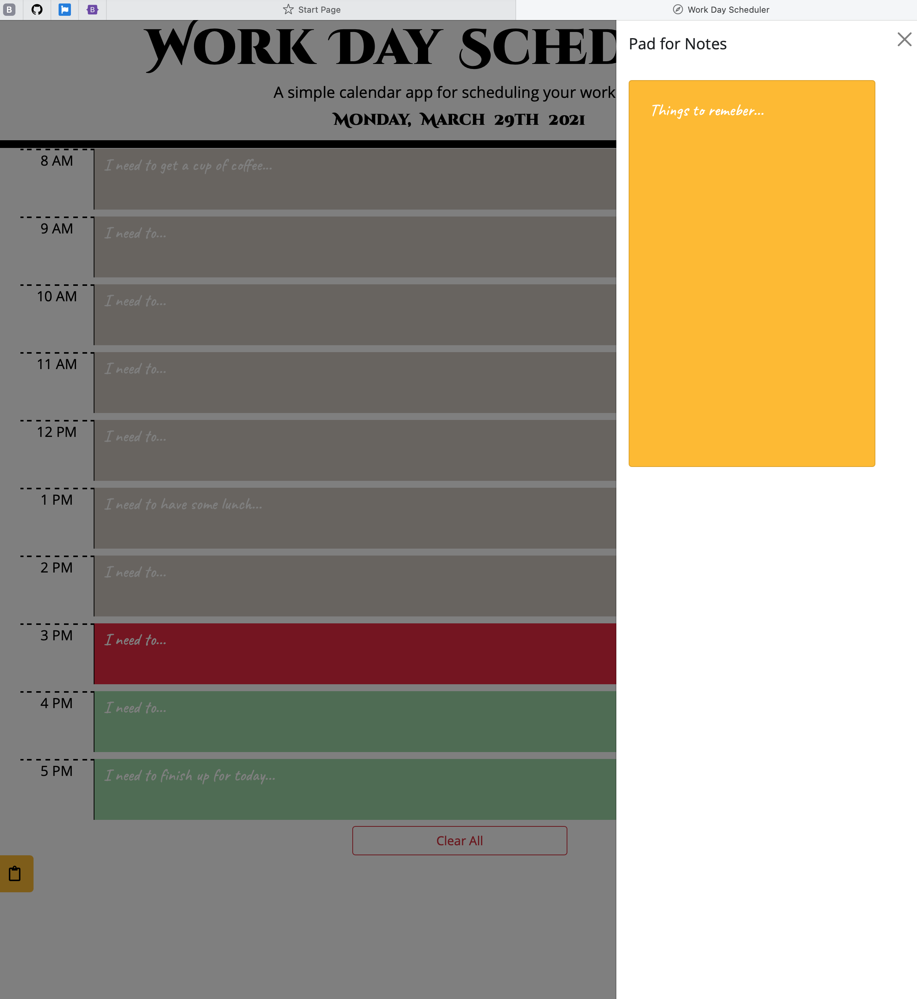

# Work-Day-Scheduler
* Coding Bootcamp - Assignment - Week 5 - Work Day Scheduler
 

## Table of Contents
* [General Info](#general-info)
* [Live URL](#live-url)
* [Walkthrough](#walkthrough)
* [Webpage Preview](#webpage-preview)
* [Contributing](#contributing)
* [Notes](#notes)

 

## General Info
The task of this assignment was to create a simple calendar application that allows a user to save events for each business hour of the day by modifying starter HTML and CSS code. 
This app runs in the browser and features dynamically updated HTML and CSS powered by JavaScript with use of jQuery, Bootstrap and Moment.js all together. 

I added some extra bits:
- #1 - a button to clear all entries in the scheduler, and 
- #2 - a pad for notes as a side window (please see [notes](#notes) for more details)

And I changed color combinations from starter version in CSS to more visually comfortable for eyes, I believe so. 

 

### Live URL
https://korolyovalara.github.io/Work-Day-Scheduler/

 

## Walkthrough
This is a daily planner to create a schedule during standard business hours 8am-5pm.

- When you load a page, you will be presented with current date on top of the page;
- In the main part of the page, you are presented with timeblocks of the scheduler, that are color coded to indicate the time at this moment:
   -  `#d6cfc7` - past;
   -  `#ef2648` - present;
   -  `#a6deae` - future.

- When you click on any timeblock, then you can enter any information you like;
    - If you click the SAVE icon button on the right of that timeblock, then the information will be saved in local storage of your browser;
    - And if you refresh the page, the information will still be there;
    - You can edit any time block and resave it as many times as you wish.
- If you press CLEAR ALL button, then all entered and stored information will be deleted.
- If you click the NOTEPAD icon button of left side of the window, then the side window will open with pad for notes;
    - You can type, copy and paste anything you like into it. But please note! if you refresh the page, then information in the notepad will be deleted.

Enjoy.

 

## Webpage Preview
The following images show the web application's appearance.

 

## Contributing
Pull requests are welcome. For major changes, please open an issue first to discuss what you would like to change, so I learn and understand it better.

Please make sure to update tests as appropriate.
 

## Notes
"Pad for Notes" is still WIP. You can type in it, however, if you refresh it won't be saved at this stage.

I had to remove "save" and "delete" options for "notes" as due to something in the code of this section started causing glitching and slow loading. I need a bit more time to find a mistake or mistype. 

It is not part of homework, but rather my personal extra bit.

---
© 2021 L Korolyova
